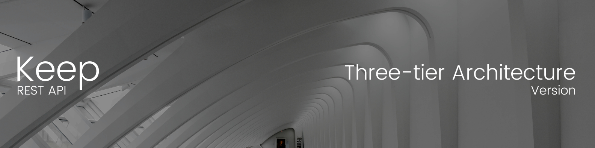
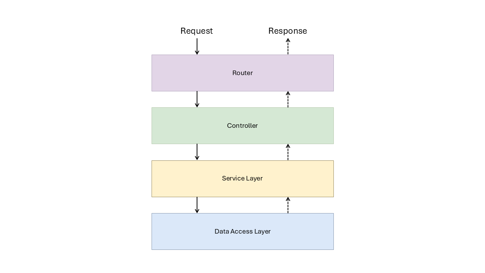
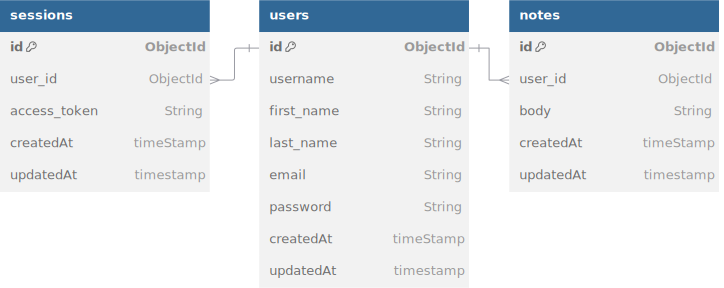

# Keep


<a href="https://github.com/iamcarlosdaniel/Keep/blob/main/LICENSE"></a>



This API is part of a note-taking application designed with a three-tier architecture. The goal of this application is to provide those who are starting out in software development with a clear understanding of how an application can scale from a three-tier architecture to a microservices-based architecture. I hope you find it very useful.

> If you only wish to download and start the project, go directly to the [Getting Started](#getting-started) section.

## [Three-tier Architecture](https://www.ibm.com/topics/three-tier-architecture)

Three-tier architecture is a well-established software application architecture that organizes applications into three logical and physical computing tiers: the presentation tier, or user interface; the application tier, where data is processed; and the data tier, where application data is stored and managed.

### The three tiers in detail

- **Presentation Tier:** This is the user interface layer where end users interact with the application. It displays and collects information and can be implemented via web browsers, desktop applications, or GUIs using HTML, CSS, and JavaScript.

- **Application Tier:** Known as the logic or middle tier, this is the core of the application where data from the presentation tier is processed using business logic and rules. It also handles data modification in the data tier.

- **Data Tier:** Also called the database tier, this is where processed information is stored and managed, using either relational databases (e.g., PostgreSQL, MySQL) or NoSQL databases (e.g., MongoDB). Communication between the presentation and data tiers occurs exclusively through the application tier.

- **Tier vs. Layer:** The terms "tier" and "layer" are often confused. A "layer" refers to a functional division within the software, while a "tier" indicates a division that operates on separate infrastructure. For instance, a Contacts app is a three-layer but single-tier application since all layers run on the same device. Understanding this distinction is crucial, as layers do not provide the same benefits as tiers.

### Benefits of three-tier architecture

The chief benefit of three-tier architecture is its logical and physical separation of functionality. Each tier can run on a separate operating system and server platform - for example, web server, application server, database server - that best fits its functional requirements. And each tier runs on at least one dedicated server hardware or virtual server, so the services of each tier can be customized and optimized without impacting the other tiers.

Below is the diagram of our system based on a three-tier architecture:



In the controller, we will manage everything related to HTTP, which means handling requests and responses from our endpoints. Additionally, we will use a lightweight Express router to direct requests to the corresponding controller.

All business logic will be implemented in the service layer, which will expose certain services (methods) to be used by the controller.

The third layer is the data access layer, where we will interact directly with the database.

---

You can learn more about the three-tier architecture in this [article from IBM.](https://www.ibm.com/topics/three-tier-architecture)

## Database

This will be the database we will use. Although we are utilizing MongoDB, which is a non-relational database, it is possible to represent an entity-relationship diagram similar to that of a SQL database to facilitate better data management.

Below is the entity-relationship diagram:

<div align="center">

</div>

As can be seen, this is a relatively simple database, but it is sufficient for the needs of this project. We have the users table, which has a one-to-many relationship with both the sessions table and the notes table.

Below is a detailed description of each of the tables.

### **Users**

The users table includes the following fields:

- **id:** This field will store the unique identifier of the user.
- **username:** A unique string field that will serve as the user’s identifier within the system.
- **first name, last name, and email:** All of these fields are of type string and will store the user’s personal information.
- **password:** This field will be used to store the user’s password in encrypted format.

> - **createdAt:** This field will store the creation date.
> - **updatedAt:** This field will store the date of the last update.

### **Notes**

The notes table consists of the following fields:

- **id:** This field will store the unique identifier for each note.
- **user_id:** This field will reference the identifier of the user who created the note.
- **body:** This field will contain the text or content of the note.

> - **createdAt:** This field will store the creation date.
> - **updatedAt:** This field will store the date of the last update.

### **Sessions**

The sessions table is structured with the following fields:

- **id:** This field will store the unique identifier for each session.
- **user_id:** This field will reference the identifier of the user associated with the session.
- **access_token:** This field will store the access token linked to the corresponding session.

> - **createdAt:** This field will store the creation date.
> - **updatedAt:** This field will store the date of the last update.

## Getting started

1. Clone the repository to your local machine:

   ```sh
   git clone https://github.com/iamcarlosdaniel/keep-api-three-tier
   ```

2. Navigate to the project directory:

   ```sh
   cd keep-api-three-tier
   ```

3. Install the necessary dependencies:

   ```sh
   npm install
   ```

4. Start the development server:

   ```sh
   npm run dev
   ```

> The project is configured to run on port 3000, so ensure that this port is available for use and check the database connection. You can find these and other options in the environment variables of the project located in the `.env` file.

## API Documentation


Swagger is an open-source set of tools that assists in designing, building, documenting, and consuming RESTful APIs. It provides a standardized and visual way to interact with APIs, enhancing the understanding and utilization of their endpoints.

Swagger is particularly beneficial in environments where collaboration between development and testing teams is essential, as it offers a clear and standardized method for documenting and consuming APIs.

We utilized this tool by employing the middleware [swagger-ui-express](https://www.npmjs.com/package/swagger-ui-express).

You can find the API documentation at the following route:

```
http://localhost:3000/api/v1/docs
```

Make sure that the project is running and that port 3000 is not occupied in order to access this route.

> You can change the port number and other options in the environment variables of the project located in the `.env` file.

## Dependencies

You can view the project dependencies along with their versions in the [package.json](package.json) file.

## License

This project is under the MIT License - Refer to the file [LICENSE](https://github.com/iamcarlosdaniel/Keep/blob/main/LICENSE) for more details.
